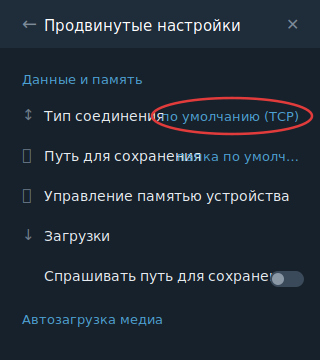
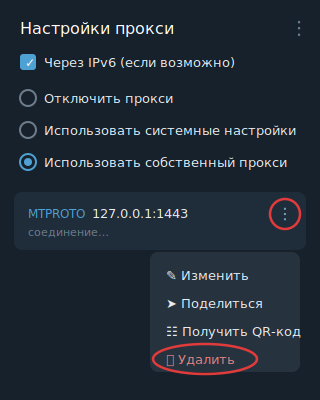

# dropo

<p align="center">
  <a href="https://github.com/Droponevedimka/dropo/releases/latest"><strong>Скачать последнюю версию dropo</strong></a>
  ·
  <a href="https://github.com/Droponevedimka/dropo">Официальный репозиторий</a>
</p>

<p style="color:#d1242f;">
  <strong><font color="#d1242f">Внимание:</font></strong>
  <font color="#d1242f">единственная оригинальная версия dropo публикуется только в репозитории</font>
  <a href="https://github.com/Droponevedimka/dropo">Droponevedimka/dropo</a>
  <font color="#d1242f">и в его разделе</font>
  <a href="https://github.com/Droponevedimka/dropo/releases/latest">GitHub Releases</a>.
  <font color="#d1242f">Будьте осторожны с копиями, сборками и архивами из других источников.</font>
</p>

> [!WARNING]
> Единственный официальный источник dropo — https://github.com/Droponevedimka/dropo. Скачивайте релизы только из GitHub Releases этого репозитория.

**dropo** — десктопный клиент для обхода блокировок и VPN на базе Flutter UI + Go-core bridge, sing-box, WireGuard and zapret/winws.

Текущая версия: **2.0.8**.

## Официальные исходники upstream-проектов

dropo собирает и использует несколько открытых компонентов. Ниже указаны оригинальные источники, откуда нужно сверять код,
релизы и лицензии сторонних проектов:

| Компонент | Назначение в dropo | Оригинальный источник |
|---|---|---|
| sing-box | VPN/TUN-движок и поддержка VLESS, VMess, Trojan, Shadowsocks, Hysteria2, TUIC | [SagerNet/sing-box](https://github.com/SagerNet/sing-box) |
| WireGuard for Windows | Нативный WireGuard на Windows | [wireguard-windows](https://git.zx2c4.com/wireguard-windows) |
| Wintun | TUN-драйвер WireGuard | [wintun](https://git.zx2c4.com/wintun) |
| zapret/winws | DPI desync-движок | [bol-van/zapret](https://github.com/bol-van/zapret) |
| WinDivert | Перехват и инъекция Windows-пакетов для winws | [basil00/Divert](https://github.com/basil00/Divert) |
| ByeDPI | Альтернативный локальный DPI-обход | [hufrea/byedpi](https://github.com/hufrea/byedpi) |
| SpoofDPI | Опциональный локальный DPI-обход | [xvzc/SpoofDPI](https://github.com/xvzc/SpoofDPI) |
| Xray-core | Xray bridge для отдельных транспортов | [XTLS/Xray-core](https://github.com/XTLS/Xray-core) |
| tg-ws-proxy | MTProto-over-WebSocket прокси для Telegram | [Flowseal/tg-ws-proxy](https://github.com/Flowseal/tg-ws-proxy) |
| Re-filter-lists | Публичные rule-set списки для маршрутизации | [1andrevich/Re-filter-lists](https://github.com/1andrevich/Re-filter-lists) |
| zapret-discord-youtube | Справочные zapret-стратегии для Discord/YouTube | [Flowseal/zapret-discord-youtube](https://github.com/Flowseal/zapret-discord-youtube) |
| zapret-discord-youtube | Справочные zapret-стратегии для отдельных сервисов | [ankddev/zapret-discord-youtube](https://github.com/ankddev/zapret-discord-youtube) |
| Flutter | Desktop UI shell | [flutter/flutter](https://github.com/flutter/flutter) |

## Назначение

dropo открывает заблокированные в РФ сервисы, отдавая приоритет **бесплатным**
методам обхода, а платную VPN-подписку используя как **фоллбэк** там, где
бесплатный метод не работает:

1. **Бесплатный DPI-обход (приоритет).** Для каждого заблокированного сервиса —
   свой подобранный метод desync (zapret/winws через WinDivert или ByeDPI/SpoofDPI
   как локальный SOCKS). Методы подбираются **прямым перебором на клиенте** и
   кешируются; внешние базы стратегий не скачиваются.
2. **VPN-подписка (фоллбэк).** При наличии ключа (VLESS/VMess/Trojan/Shadowsocks/
   Hysteria2/TUIC через sing-box, xhttp — через Xray-bridge) сервис, для которого
   бесплатный метод не сработал, переключается на VPN per-service.
3. **Telegram** заблокирован по IP/протоколу — его desync не открывает; работает
   через бундлованный локальный MTProto-over-WebSocket-прокси (`tg-ws-proxy`).
4. **WireGuard** — отдельный нативный путь для внутренних/корпоративных сетей.

По умолчанию RU-сайты идут **напрямую**; VPN/обход применяется только к
заблокированному, если не включён специальный режим маршрутизации.

## Платформы

Смысл работы и логика (бесплатный desync → VPN-фоллбэк → WireGuard → Telegram-прокси,
пер-сервисные стратегии, режимы маршрутизации) **одинаковы на всех платформах**.
Отличается только платформенный движок перехвата трафика.

| Платформа | Статус | Движок перехвата |
|---|---|---|
| **Windows 10/11 x64** | **Реализовано** | winws + WinDivert (Deep Windows) / sing-box TUN (Compatibility) |
| Linux / Unix | Планируется (последовательно) | nfqws/tpws (NFQUEUE) / TUN |
| Android | Планируется | VpnService + nfqws-аналог |
| macOS | Планируется | NetworkExtension / TUN |

Ниже описана **Windows-реализация** (текущая единственная). Для остальных платформ
сохраняется тот же каталог сервисов, та же таксономия блокировок и та же лаба-цензор
([docs/TESTING.md](docs/TESTING.md)); платформенная обвязка добавляется позже.

Единое Go-ядро (пакет `app/`, собирается как `dropo-core.exe`) платформонезависимо;
движок перехвата спрятан за интерфейсом `InterceptionEngine` — добавление ОС = один
файл-адаптер `core_interception_engine_<os>.go`, без правок общей логики. Мобильные
(Android/iOS) — нативный VPN-shell поверх того же ядра через gomobile, не вариант
этого бинаря. Локальный bridge защищён per-launch токеном (`X-Dropo-Token`) на
изменяющих эндпоинтах. Подробности — [docs/PLATFORMS.md](docs/PLATFORMS.md).

## Возможности

- Подписки sing-box: VLESS, VMess, Trojan, Shadowsocks, Hysteria2, TUIC (xhttp — через Xray-bridge).
- Нативный WireGuard для рабочих сетей (до 20 конфигов одновременно).
- Бесплатный обход включён по умолчанию: zapret/winws, ByeDPI, опционально SpoofDPI.
- Пер-сервисный подбор: у каждого сервиса свой ранжированный метод; первый рабочий кешируется.
- Режимы маршрутизации: `blocked_only` (по умолчанию), `except_russia`, `all_traffic`, скрытие RU-трафика.
- Telegram через локальный MTProto-прокси с автоподстановкой и живой проверкой наличия.
- Профили подключений с отдельными подписками и WireGuard-конфигами.
- Снятие отпечатка блокировки провайдера (для разработки методов обхода).
- Статистика, логи, импорт/экспорт профилей, проверка обновлений.

## Принцип работы (Windows)

### Движки и сетевые режимы

- **Deep Windows** — основной режим **без подписки**: zapret/winws перехватывает
  трафик через WinDivert на уровне пакетов; sing-box TUN **не** поднимается.
- **Compatibility TUN** — режим **с подпиской**: маршрутизацией владеет sing-box TUN.
  При этом winws-движок desync запускается **рядом** (гибрид): per-service группа
  `bypass-<service>` становится `urltest[direct, VPN]` — winws десинхронизирует
  путь `direct`, поэтому где обход работает, сервис идёт бесплатно (direct), а где
  не открывается — автоматически уходит в VPN. Compatibility TUN без winws остаётся
  только аварийным fallback, если Deep Windows-движок не стартовал.

Выбор режима автоматический (`auto`); ручной оверрайд — в Настройках («Сетевой
режим»).

### Маршрутизация (blocked_only по умолчанию)

- RU-домены/IP (VK, Yandex, Ozon, Sber, Gosuslugi и пр.) — **direct**.
- Заблокированные сервисы — каждый в свою группу `bypass-<service>`:
  - blockType `dpi` (YouTube, Discord, X, …) → winws desync (free), VPN-фоллбэк;
  - blockType `vpn` (Meta/Instagram, WhatsApp) → VPN (desync их не открывает — IP-блок);
  - blockType `proxy` (Telegram) → локальный MTProto-прокси, VPN как фоллбэк.
- Широкий catch-all заблокированного (Re:filter/community rule-sets) → `smart-bypass`
  (free-proxy + VPN), не direct.
- `route final = direct` — всё неклассифицированное идёт напрямую.
- Тумблер «Открывать все иностранные сайты через VPN/обход» = `except_russia`.
- Вспомогательные процессы (`ciadpi.exe`, `spoofdpi.exe`, `winws.exe`, `tg-ws-proxy.exe`)
  маршрутизируются `direct` рано, чтобы не зациклить TUN.

### AI-сервисы

Тег `openai` покрывает OpenAI/ChatGPT/Codex, Claude/Anthropic, Copilot, Cursor,
Perplexity, Gemini, xAI/Grok, Meta AI. Это **VPN-only**: ByeDPI/desync не меняет
публичный IP и не лечит гео-ограничения. С подпиской `bypass-openai` имеет
единственного кандидата `auto-select`; без подписки AI-домены и IDE-процессы идут
direct/pass-through.

### Логи

`%LOCALAPPDATA%\dropo\logs\dropo-YYYYMMDD-HHMMSS.log` (+ дубль в `%TEMP%\dropo`).
Содержат `[Diag]`, `[NetworkMode]`, `[DeepWindowsPlan]`, `[RouteProbe]`,
`[FreeAccess]`, `[Zapret]`, `[Telegram]` и статус WinDivert.

## Telegram и локальный прокси

Telegram заблокирован по IP/протоколу — desync (winws) его не открывает. dropo
поднимает в фоне локальный MTProto-over-WS-прокси (`tg-ws-proxy`, `127.0.0.1:1443`)
и подставляет его в Telegram ссылкой `tg://proxy` (одно подтверждение внутри
Telegram — это его собственная защита).

- **Наличие прокси проверяется живьём**, а не по одноразовому флагу: dropo
  смотрит по таблице TCP, есть ли активное соединение Telegram → `127.0.0.1:1443`,
  и если Telegram запущен, но прокси удалён/выключен — **заново** открывает
  `tg://proxy`. Так покрываются удаление прокси, свежая распаковка и отклонённый
  запрос.
- Рекомендуемый метод Telegram — **«Автоматически»** (бесплатный WS-обход на
  прямом соединении). «Telegram → VPN-подписка» имеет смысл только при **не-РФ**
  выходе: с московским выходом Telegram остаётся заблокированным.

> ⚠️ **При закрытии приложения.** Локальный прокси сохраняется в настройках
> Telegram и **не удаляется программно** (`tg://` умеет только добавлять, `tdata`
> зашифрован). Поэтому при каждом закрытии dropo (кнопка `Выход` или выход из
> трея), уже после остановки всех процессов, показывается окно-напоминание с
> инструкцией и таймером 15 секунд. Это защита: иначе после удаления dropo
> Telegram не подключится, пока прокси не убрать вручную.

Как удалить прокси в Telegram:

1. Telegram → **Настройки** → **Продвинутые настройки**
2. Раздел «Данные и память» → **Тип соединения**
3. **Настройки прокси** → у прокси `MTPROTO 127.0.0.1:1443` нажмите **⋮** → **Удалить**

| Шаг 1 — Тип соединения | Шаг 2 — удалить прокси |
| --- | --- |
|  |  |

## Настройки

Все переключатели и селекты применяются сразу, без кнопки «Сохранить»:

- автозапуск, уведомления, логирование и уровень логов;
- автообновление подписки, проверка обновлений;
- тема и язык;
- **режим маршрутизации** и **сетевой режим** (auto / Deep Windows / Compatibility TUN);
- `Не использовать бесплатные методы` (opt-out: тогда нужен VPN/WireGuard);
- скрытие RU-трафика и адрес RU-proxy;
- per-service метод обхода (кнопка **🧩 Сервисы**);
- **🔍 Проверить** — встроенный тест доступности сервисов (без PowerShell-окон);
- **🩻 Снять отпечаток** — снимает, как провайдер блокирует сервисы, и сохраняет
  файл для отправки разработчику (см. [docs/TESTING.md](docs/TESTING.md) → L5).

Индикатор активного сетевого режима — компактный бейдж в левом верхнем углу.

## Windows: требования и сборка

Требования: Windows 10/11 x64, права администратора для
TUN/WireGuard (UAC запрашивается до инициализации).

```powershell
.\build.ps1                 # всё: приложение + portable ZIP (+ installer при наличии NSIS)
.\build.ps1 -Build          # только dropo.exe
.\build.ps1 -Portable       # только portable ZIP
.\build.ps1 -Installer      # только установщик
.\build.ps1 -Clean
```

Скрипт берёт версию из `version.json`, собирает `dropo.exe`, скачивает/проверяет
фильтры Re:filter и `tg-ws-proxy`, копирует sing-box, WireGuard, ByeDPI,
zapret/winws, опц. SpoofDPI, Xray и фильтры в `bin`, формирует папку и ZIP
`dropo-{version}-{hash}`.

## Разработка

```powershell
# terminal 1: Go core bridge
cd app
go run . --no-tray --listen 127.0.0.1:17890

# terminal 2: Flutter desktop UI with hot reload
cd flutter_app
flutter run -d windows --dart-define=DROPO_CORE_ENDPOINT=http://127.0.0.1:17890

# tests
cd app
go test ./...
cd ../flutter_app
flutter analyze
flutter test
```

Релизный gate и runtime-проверки — `tools/preflight-release.ps1` и `TestManual*`;
подробности и все слои тестирования — **[docs/TESTING.md](docs/TESTING.md)**.

## Тестирование

Полное описание (unit → UI → release gate → runtime → отпечаток блокировки →
лаба-цензор с эмуляцией ТСПУ вне РФ) — **[docs/TESTING.md](docs/TESTING.md)**.
Лаба-цензор живёт в **[testlab/](testlab/README.md)**: эмулирует DPI/ТСПУ-блокировки
(naive `xt_string` и stateful reassembling NFQUEUE-цензор с покрытием
split/seqovl/fooling/QUIC) и питается отпечатками от клиентов.

## Структура

```text
app/
  main.go                    # Go-core entrypoint and local HTTP bridge
  http_bridge.go             # Flutter <-> Go API bridge
  app_api_*.go               # VPN, profiles, fingerprint, update APIs
  core_*.go                  # storage, routing, WireGuard, filters, telegram, detect
  service_strategies.json    # per-service desync strategy catalog
flutter_app/
  lib/                       # Flutter Windows/Android UI
  test/                      # Flutter widget tests
dependencies/                # sing-box, wireguard, byedpi, zapret, xray, filters
testlab/                     # censor lab (blocking emulation) - docs/TESTING.md L6
docs/                        # TESTING.md, UPDATE.md, platform notes
tools/                       # preflight-release.ps1, check-*.ps1, client-quick-check.ps1
```

## Конфигурация и данные

- настройки/профили: `resources/settings.json`
- активный конфиг sing-box: `resources/active_config.json`
- отпечатки блокировок: `resources/fingerprints/`
- логи: `%LOCALAPPDATA%\dropo\logs\` (+ `%TEMP%\dropo`)

Legacy-миграция читает старые данные из `KampusVPN`, если они есть.

## Changelog

### 2.0.2

- Гибридная маршрутизация: с подпиской winws-desync работает **рядом** с sing-box
  TUN; per-service `urltest[direct, VPN]` — бесплатно где обход работает, VPN где нет.
- Сервисы blockType `vpn`/`proxy` (Meta, WhatsApp, Telegram) уходят в VPN-фоллбэк,
  а не в «мёртвый» direct.
- Telegram: живой контроль наличия прокси (TCP-таблица) и переподстановка вместо
  одноразового флага; окно-напоминание об удалении прокси при закрытии (трей и кнопка).
- Снятие отпечатка блокировки в приложении + лаба-цензор (`testlab/`) для разработки
  методов обхода вне РФ.
- UI: тест доступности и снятие отпечатка перенесены в Настройки; убраны
  «Актуальные методы» и «Папка»; индикатор режима — в левом верхнем углу; без
  глобальной модалки при подключении/отключении.

### 2.0.0

- Ренейминг в `dropo`, новый UI (выезжающие панели, тосты), мгновенные настройки,
  UAC до инициализации, базы маршрутизации обновляются только при сборке.

## License

MIT License © 2026 dropo
